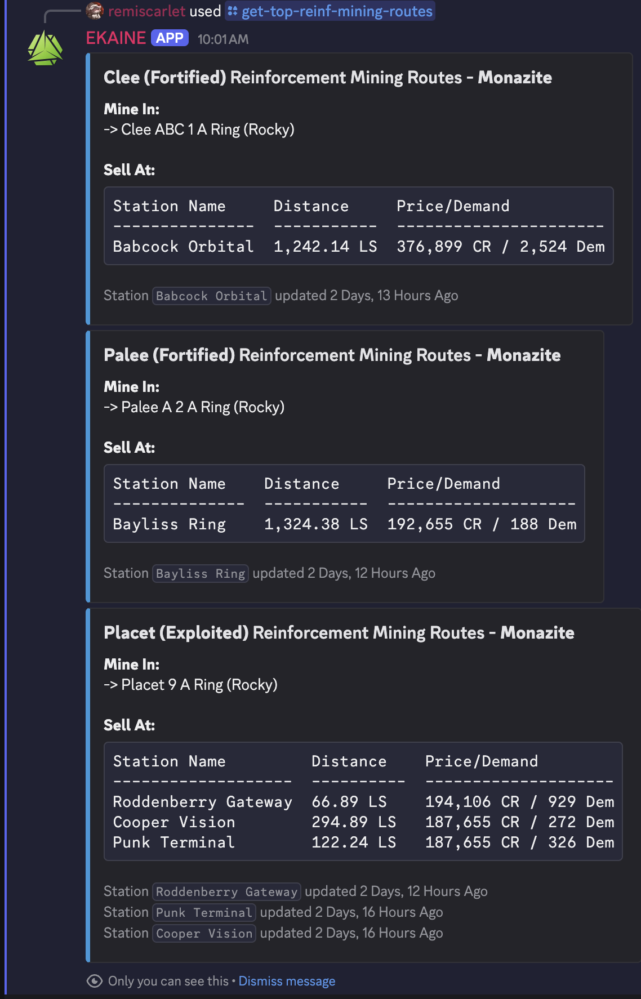
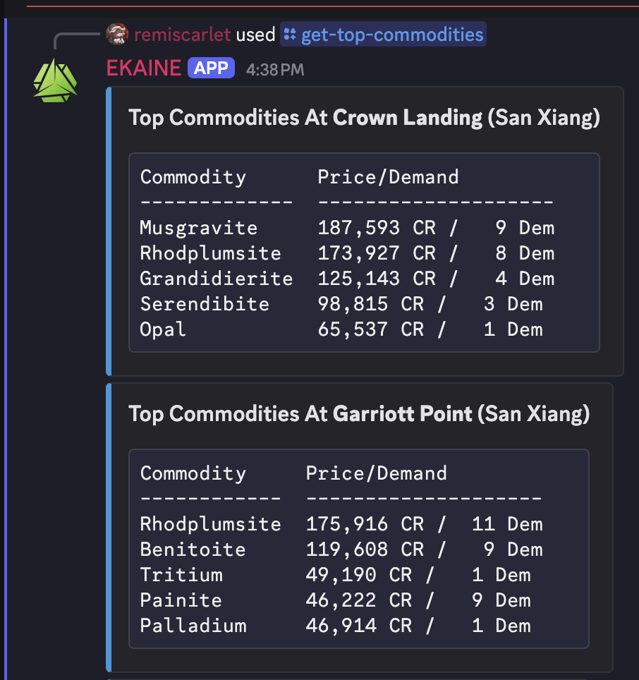
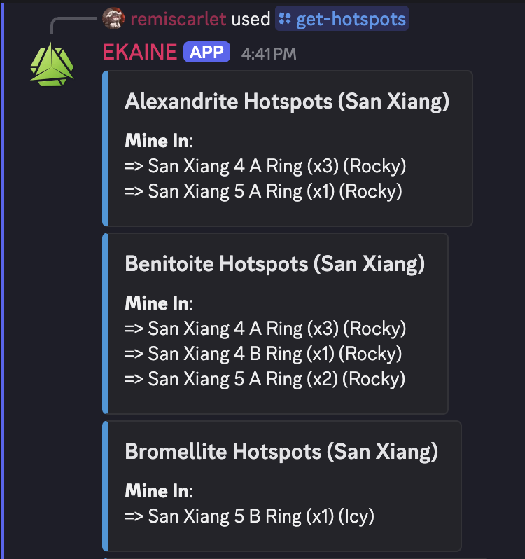

# EKAINE
###### (Enhanced Knowledge Analysis and Insights Notification Engine)

EKAINE delivers a fully schematized and enriched database optimized for powerful, flexible querying—surpassing the capabilities of existing tools. Its most powerful feature is the seamless cross-querying of system, station, body, and market data through standard SQL.

## What Is

EKAINE is a **data ingestion, enrichment, analysis, and workflow automation system** for *Elite Dangerous* game data.

It collects, processes, and exposes structured data from external sources like **EDDN** (Live), **Spansh** (Dumps), and **EDSM** (Dumps), and allows interaction with insights via:
- Discord bots
- Webhooks
- CLI tools
- REST APIs (Maybe)

### Features
Most features are focused on Powerplay 2.0 mechanics.

Major features are split into "queries" and "alerts"

#### Queries (All queries have configurable arguments/filters):
- Get Hotspots for System
- Get Top N Commodity Prices at Stations for System
- Get Top Mining Reinforcement Routes Globally
- Get Mining Reinforcement Routes for System
- Get Mining Acqusition Routes for System

#### Alerts (Coming Soon):
- Notify When System Enters Boom (Filterable)
- Notify Systems Being Undermined
- Notify System Control Point Thresholds ('50%', '75%', etc to 'Min Control Score', 'Fortified', etc)

Queries and Alerts are made by querying a fully schematized timescale/PostgreSQL database. Timescale allows time-series queries and alerts while the standard PG allows stateful queries and alerts.

Many more to come.

## Usage
### Pre-req
- Install [Poetry](https://python-poetry.org/docs/#installation)
- `git clone` this repo
- If you already have a Spansh `galaxy_populated.json` data dump, add it to `data/` with default filename
  - If so, `make import-spansh` instead of `make run-pipeline`

### Initial Setup/Database Hydration
```
make setup
make run-pipeline
```

### EDDN Listener
```
make eddn-listener
```

```
[2025-05-22 23:54:12][INFO]: [System DB Updated] Eorasa
[2025-05-22 23:54:12][INFO]: [Faction Presence DB + Timeseries Updated] Eorasa - 6 factions
[2025-05-22 23:54:12][INFO]: [System DB Updated] HIP 80870
[2025-05-22 23:54:12][INFO]: [Faction Presence DB + Timeseries Updated] HIP 80870 - 4 factions
[2025-05-22 23:54:13][INFO]: [Signals Timeseries Updated] Eorasa - 5 Signals
[2025-05-22 23:54:14][INFO]: [Market Commodities DB Updated] Ackcanphi - X4F-W5B - 0 Commodities
[2025-05-22 23:54:15][INFO]: [Signals Timeseries Updated] Konggul - 11 Signals
[2025-05-22 23:54:16][INFO]: [Signals Timeseries Updated] Tiangchi - 41 Signals
[2025-05-22 23:54:17][INFO]: [Signals Timeseries Updated] Barathaona - 33 Signals
[2025-05-22 23:54:17][INFO]: [System DB Updated] HIP 4005
[2025-05-22 23:54:17][INFO]: [Faction Presence DB + Timeseries Updated] HIP 4005 - 6 factions
[2025-05-22 23:54:17][INFO]: [Faction Presence DB + Timeseries Updated] Barathaona - 7 factions
[2025-05-22 23:54:18][INFO]: [Market Commodities DB Updated] Winiama - T9Y-T5G - 1 Commodities
[2025-05-22 23:54:18][INFO]: [Signals Timeseries Updated] Aries Dark Region JI-J b9-1 - 3 Signals
[2025-05-22 23:54:18][INFO]: [System DB Updated] Aries Dark Region JI-J b9-1
[2025-05-22 23:54:18][INFO]: [Market Commodities DB Updated] HIP 50653 - Hand Landing - 148 Commodities
[2025-05-22 23:54:18][INFO]: [Signals Timeseries Updated] Col 285 Sector LH-M c7-10 - 6 Signals
```

### Adhoc SQL Queries
```
make pg-shell
```

### Discord Integration
```
make discord-bot
```






## Dev Stuff
- Linters and type checkers run on commit via `pre-commit`

To run the linter, fix lint issues, and type check:
```
make lint-fix-check
```

### Interesting Locations (For Now)
- `src/ekaine/interfaces/discord/bot.py`
  - Discord bot entrypoint
- `src/ekaine/postgresql/`
  - Any and all database-specific things like SQL files, sqlalchemy schemas, etc
  - Except DB migrations.
- `src/ekaine/alembic/`
  - Stores all DB migrations
- `src/ekaine/ingestion/`
  - EDDN live update listener
  - Data ingestion logic
  - Spansh dump data DL/import pipeline

### DB Schema
- See https://dbdiagram.io/d/EKAINE-680e5f821ca52373f58ba72d

