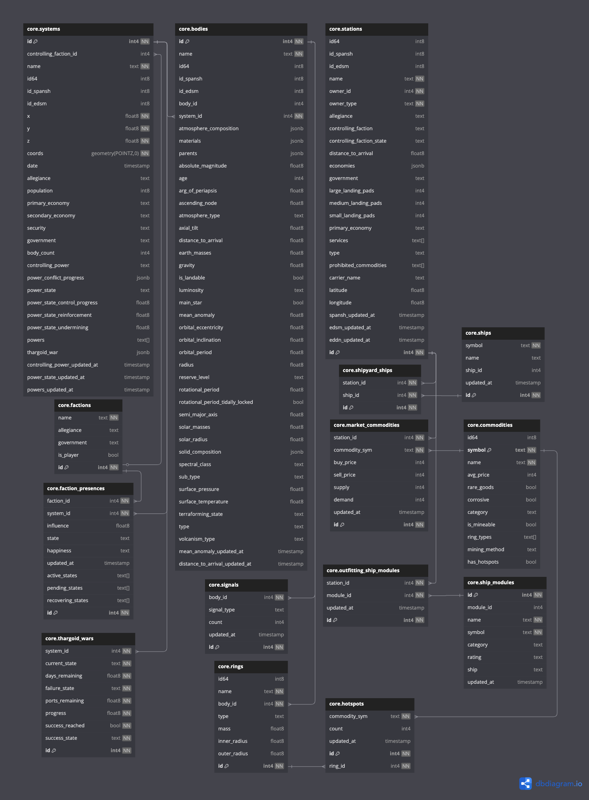

# ED Foo (Enhanced Knowledge Analysis and Insights Notification Engine)

<sub>Extremely WIP — initial refactor in progress.</sub>
---

## Usage
### Pre-req
- Install [Poetry](https://python-poetry.org/docs/#installation)
- `git clone` this repo
- If you already have a Spansh `galaxy_populated.json` data dump, add it to `data/` with default filename
  - If so, `make import-spansh` instead of `make run-pipeline`

### Setup
```
make setup
make run-pipeline
```

### Adhoc SQL Queries
```
make pg-shell
```

### Discord Integration


### CLI Usage
- We'll eventually expose more like an HTTP API and crons/webhooks

```
$ poetry run cli api get-mining-expandable 'Col 285 Sector OJ-M b22-6'

====== DETAILS ======
Target Unoccupied System: Col 285 Sector OJ-M b22-6

====== MINING ACQUISITION ROUTES ======
Mine                   In                                   Sell In                    At                For    Demand
---------------------  -----------------------------------  -------------------------  -------------  ------  --------
LowTemperatureDiamond  Col 285 Sector UE-G c11-27 5 B Ring  Col 285 Sector OJ-M b22-6  Roy's Retreat  305239        60
LowTemperatureDiamond  Col 285 Sector UE-G c11-27 7 A Ring  Col 285 Sector OJ-M b22-6  Roy's Retreat  305239        60
Tritium                Col 285 Sector UE-G c11-27 7 A Ring  Col 285 Sector OJ-M b22-6  Roy's Retreat   61865       497
LowTemperatureDiamond  Col 285 Sector UE-G c11-27 8 A Ring  Col 285 Sector OJ-M b22-6  Roy's Retreat  305239        60
Tritium                Col 285 Sector UE-G c11-27 8 A Ring  Col 285 Sector OJ-M b22-6  Roy's Retreat   61865       497
Platinum               Col 285 Sector UE-G c11-27 6 A Ring  Col 285 Sector OJ-M b22-6  Roy's Retreat  183325        90
```

```
$ poetry run cli api get-acquirable-systems 'Col 285 Sector UE-G c11-27'

====== CURRENT SYSTEM (ACQUIRING) ======
Name: Col 285 Sector UE-G c11-27

====== ACQUIRABLE SYSTEMS (UNOCCUPIED) ======
System Name                 Population    Primary Economy    Power Conflict Progress
--------------------------  ------------  -----------------  ---------------------------------------------------------------------------
Col 285 Sector MD-O b21-0   13,049,935    High Tech          Nakato Kaine: 0.0
Col 285 Sector QJ-M b22-0   53,241        Military           Nakato Kaine: 0.000517
Col 285 Sector UP-K b23-0   13,000        Colony             Nakato Kaine: 0.0
HIP 71629                   1,244,291     Extraction         Nakato Kaine: 0.0
HIP 67572                   15,000        Extraction         Nakato Kaine: 0.0
HR 5252                     18,444,892    Extraction         Nakato Kaine: 0.000175
Col 285 Sector VE-G c11-6   6,000         Industrial         Nakato Kaine: 0.0044
HIP 67783                   4,500         Industrial         Nakato Kaine: 0.0
Col 285 Sector QJ-M b22-1   10,000        Military           Nakato Kaine: 0.004825
...etc
```

```
$ poetry run cli api get-hotspots-in-system-by-commodities 'San Xiang' Monazite Platinum

====== SYSTEM ======
Name: San Xiang

Ring                Ring Type    Commodity      Count
------------------  -----------  -----------  -------
San Xiang 1 A Ring  Metallic     Monazite           1
San Xiang 1 A Ring  Metallic     Platinum           2
San Xiang 1 B Ring  Metal Rich   Monazite           1
San Xiang 4 A Ring  Rocky        Monazite           3
San Xiang 5 A Ring  Rocky        Monazite           2
```

```
$ poetry run cli api get-top-commodities-in-system 'San Xiang'

====== SYSTEM ======
Name: San Xiang

Station Name              Distance    Commodity                  Sell Price      Demand  Buy Price      Supply  Updated Last
------------------------  ----------  -------------------------  ------------  --------  -----------  --------  --------------
Crown Landing             275.29 LY   MineralExtractors          1237 CR          11199  0 CR                0  Unknown
Crown Landing             275.29 LY   BioReducingLichen          1613 CR           7164  0 CR                0  Unknown
Crown Landing             275.29 LY   HazardousEnvironmentSuits  861 CR            6259  0 CR                0  Unknown
Crown Landing             275.29 LY   MineralOil                 776 CR            2358  0 CR                0  Unknown
Crown Landing             275.29 LY   HydrogenPeroxide           3209 CR           2294  0 CR                0  Unknown
Garriott Point            338.27 LY   MineralExtractors          1237 CR           7537  0 CR                0  Unknown
Garriott Point            338.27 LY   BioReducingLichen          1601 CR           4756  0 CR                0  Unknown
Garriott Point            338.27 LY   HazardousEnvironmentSuits  869 CR            4585  0 CR                0  Unknown
Garriott Point            338.27 LY   MineralOil                 776 CR            3164  0 CR                0  Unknown
Garriott Point            338.27 LY   Goslarite                  7854 CR           2262  0 CR                0  Unknown
K2Q-G4J                   284.67 LY   Tritium                    118366 CR           13  0 CR                0  Unknown
KFH-1QJ                   199.14 LY   Tritium                    60510 CR          1271  0 CR                0  Unknown
KLV-1QJ                   194.37 LY   Benitoite                  300321 CR          500  0 CR                0  Unknown
KLV-1QJ                   194.37 LY   Alexandrite                230277 CR          500  0 CR                0  Unknown
KLV-1QJ                   194.37 LY   Tritium                    50072 CR           437  0 CR                0  Unknown
KLV-1QJ                   194.37 LY   Musgravite                 300521 CR          300  0 CR                0  Unknown
KLV-1QJ                   194.37 LY   Monazite                   350922 CR          235  0 CR                0  Unknown
KLV-1QJ                   194.37 LY   Osmium                     45198 CR           220  0 CR                0  Unknown
Leinster Terminal         193.45 LY   SurfaceStabilisers         1106 CR           7550  0 CR                0  Unknown
Leinster Terminal         193.45 LY   Grain                      739 CR            5183  0 CR                0  Unknown
Leinster Terminal         193.45 LY   Clothing                   862 CR            3150  0 CR                0  Unknown
Leinster Terminal         193.45 LY   Beer                       553 CR            2334  0 CR                0  Unknown
Leinster Terminal         193.45 LY   WaterPurifiers             845 CR            1311  0 CR                0  Unknown
Ortiz's Garden            188.41 LY   AnimalMonitors             900 CR            6424  0 CR                0  Unknown
Ortiz's Garden            188.41 LY   AquaponicSystems           869 CR            5697  0 CR                0  Unknown
Ortiz's Garden            188.41 LY   Biowaste                   721 CR            2829  0 CR                0  Unknown
Ortiz's Garden            188.41 LY   CropHarvesters             2979 CR           1687  0 CR                0  Unknown
Ortiz's Garden            188.41 LY   TerrainEnrichmentSystems   5757 CR           1215  0 CR                0  Unknown
Stronghold Carrier        195.21 LY   Cobalt                     5206 CR           8749  0 CR                0  Unknown
Stronghold Carrier        195.21 LY   Pyrophyllite               14301 CR          6522  0 CR                0  Unknown
Stronghold Carrier        195.21 LY   Rutile                     2693 CR           5854  0 CR                0  Unknown
Stronghold Carrier        195.21 LY   Lithium                    2442 CR           4326  0 CR                0  Unknown
Stronghold Carrier        195.21 LY   Gallite                    13694 CR          3696  0 CR                0  Unknown
V1Z-B2X                   0.00 LY     Steel                      6270 CR           6000  0 CR                0  Unknown
V5H-L0N                   1974.66 LY  Gold                       47609 CR           155  0 CR                0  Unknown
Ware Research Laboratory  471.05 LY   Cobalt                     7852 CR          44046  0 CR                0  Unknown
Ware Research Laboratory  471.05 LY   Pyrophyllite               14301 CR         41853  0 CR                0  Unknown
Ware Research Laboratory  471.05 LY   Rutile                     5385 CR          36964  0 CR                0  Unknown
Ware Research Laboratory  471.05 LY   ConductiveFabrics          1234 CR          36107  0 CR                0  Unknown
Ware Research Laboratory  471.05 LY   Lithium                    2467 CR          27762  0 CR                0  Unknown
```

## Dev Stuff
- Linters and type checkers run on commit via `pre-commit`

To run the linter, fix lint issues, and type check:
```
make lint-fix-check
```

### Interesting Locations (For Now)
- `src/adapters/ingress/cli/router.py`
  - CLI entrypoint
- `src/adapters/persistence/postgres/`
  - Any and all database-specific things like SQL files, sqlalchemy schemas, etc
  - Except DB migrations.
- `src/alembic/`
  - Stores all DB migrations
- `src/ingestion/`
  - Data ingestion logic
  - Currently only contains Spansh dump import pipeline
  - Will soon contain EDDN live update listener

### DB Schema
- See https://dbdiagram.io/d/EKAINE-680e5f821ca52373f58ba72d


---

# Design Overview

## What Is

This project is a **data ingestion, enrichment, analysis, and workflow automation system** for *Elite Dangerous* game data.

We collect, process, and expose structured data from external sources like **Spansh**, **EDSM**, and **EDDN**, and allow interaction with insights via:
- CLI tools
- Discord bots
- Webhooks
- REST APIs


---

## Technologies

| Purpose                         | Technology                   | Why |
|:---------------------------------|:------------------------------|:----|
| Project Management              | Poetry                        | Modern Python packaging and dependency management |
| Build Automation                | Makefiles                     | Human-readable, cross-platform dev commands |
| Core Data Modeling              | Pydantic                      | Type-safe schemas, OpenAPI generation, easy codegen |
| CLI Development                 | Typer                         | Pydantic-integrated CLI with minimal boilerplate |
| Bot                             | Discord.py                    | Discord bot integration |
| Database                        | Postgres + SQLAlchemy         | Relational storage, robust ORM mapping |
| Migrations                      | Alembic                       | Database schema evolution |
| Code Generation (planned)       | OpenAPI, JSON Schema export   | External data contracts and client generation |