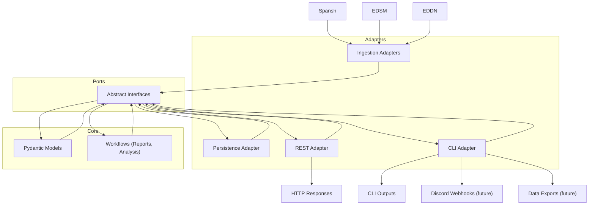

# Architecture Overview

---

# Diagram

```text
                 +---------------------------+
                 |     External Sources      |
                 | (Spansh, EDSM, EDDN, etc) |
                 +------------+--------------+
                              |
                              v
+-------------------------------------------------------------+
|                          ADAPTERS                           |
|-------------------------------------------------------------|
| - Ingestion Adapters  (future: EDDN live consumer)          |
| - Persistence Adapter (SQLAlchemy -> Postgres)              |
| - REST Adapter (FastAPI)                                    |
| - CLI Adapter (Typer)                                       |
+-------------------------------------------------------------+
                              |
                              v
+-------------------------------------------------------------+
|                           PORTS                             |
|-------------------------------------------------------------|
| - Abstract Interfaces (e.g., UserPort, AnalysisPort)        |
| - Define expected behaviors but no technology binding       |
+-------------------------------------------------------------+
                              |
                              v
+-------------------------------------------------------------+
|                        CORE DOMAIN                          |
|-------------------------------------------------------------|
| - Pydantic Models (Logical Schemas)                         |
| - Workflows (Business Logic: analysis, insights, reporting) |
| - Pure Python, no external tech dependency                  |
+-------------------------------------------------------------+
                              |
                              v
+-------------------------------------------------------------+
|                      External Outputs                       |
|-------------------------------------------------------------|
| - HTTP Responses                                            |
| - CLI Outputs                                               |
| - Discord Webhooks / Notifications (future)                 |
| - Data Exports (future)                                     |
+-------------------------------------------------------------+
```

---

# Layer Responsibilities

| Layer | Responsibility |
|:------|:---------------|
| **External Sources** | Provide raw external game data (varied formats) |
| **Adapters** | Convert external/internal communication into Core-friendly calls |
| **Ports** | Define what the Core expects (abstract contracts) |
| **Core** | Pure, reusable, business-focused logic and types |
| **External Outputs** | Deliver results back into the world (APIs, CLIs, bots) |

---

# How Data Flows

1. External Source (e.g., EDDN JSON event) ingested via Adapter.
2. Adapter parses and validates, normalizes to Core models.
3. Core workflows operate on logical models.
4. Results returned back through Ports -> Adapters.
5. Outputs exposed through REST, CLI, notifications, etc.

---

# Benefits of This Layout

- New ingestion sources = **add an adapter**, no Core changes.
- New outputs = **add an adapter**, no Core changes.
- Easy to test Core in isolation (no FastAPI, no SQLAlchemy needed).
- Clean boundaries = easier scaling, easier maintenance, easier onboarding.


# Mermaid Diagram

